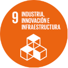
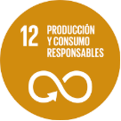

     		  

**UNIVERSIDAD PRIVADA DE TACNA**

**FACULTAD DE INGENIERÍA**

**Escuela Profesional de Ingeniería de Sistemas**

` `**Proyecto “DataFiller”**

Curso: *Pruebas y Calidad de Software*

Docente: *Mag. Patrick Cuadros Quiroga*

Integrantes:

[***SEBASTIAN NICOLAS FUENTES AVALOS](mailto:sf2022073902@virtual.upt.pe)		***(2022073902)***

[***MAYRA FERNANDA CHIRE RAMOS](mailto:mc2021072620@virtual.upt.pe)			***(2021072620)***

[***GABRIELA LUZKALID GUTIERREZ MAMANI](mailto:gg2022074263@virtual.upt.pe) 	***(2022074263)***

**Tacna – Perú**

***2025***

**Sistema *DataFiller***

**Informe de Factibilidad**

**Versión *{1.0}***

|CONTROL DE VERSIONES||||||
| :-: | :- | :- | :- | :- | :- |
|Versión|Hecha por|Revisada por|Aprobada por|Fecha|Motivo|
|1\.0|MCR|SFA|GLG|20/03/2025|Versión Original|

**ÍNDICE GENERAL**

[**1. Descripción del Proyecto	4**](#_fcwsj01q38yg)

[1.1 Nombre del proyecto	4](#_kjatux2dah2d)

[1.2 Duración del proyecto	4](#_ie5qsoidaczj)

[1.3 Descripción	4](#_49w28yt2b0ta)

[1.4 Objetivos	4](#_s7gxe01lvdty)

[1.4.1 Objetivo general	4](#_xtqc43fb2t5p)

[1.4.2 Objetivos Específicos	5](#_3vou02dfla8y)

[**2. Riesgos	5**](#_pz4eg722jffu)

[**3. Análisis de la Situación actual	5**](#_z7eu07urbaaa)

[3.1 Planteamiento del problema	5](#_mq16xi4noob6)

[3.2 Consideraciones de hardware y software	6](#_9wotza36wt90)

[**4. Estudio de Factibilidad	6**](#_p4m255heczbj)

[4.1 Factibilidad Técnica	7](#_fxcusqyjljb8)

[4.2 Factibilidad Económica	7](#_hghumwxr82n9)

[4.2.1 Costos Generales	7](#_ljba657rsjv9)

[4.2.2 Costos operativos durante el desarrollo	7](#_35fkzig7ppry)

[4.2.3 Costos del ambiente	7](#_qs5wk6xpqxx0)

[4.2.4 Costos de personal	8](#_xiaemwri5bde)

[4.2.5 Costos totales del desarrollo del sistema	8](#_qcw2lm9u9prd)

[4.3 Factibilidad Operativa	8](#_wvpm2eoy0ppd)

[4.4 Factibilidad Legal	8](#_xyouzusd836p)

[4.5 Factibilidad Social	8](#_fy0wtnshfwzc)

[4.6 Factibilidad Ambiental	8](#_jwhj3yd7plya)

[**5. Análisis Financiero	8**](#_7zacpefbfskr)

[5.1 Justificación de la Inversión	8](#_r1fjm5k39nzb)

[5.1.1 Beneficios del Proyecto	9](#_r5ebd8v2chin)

[5.1.2 Criterios de Inversión	9](#_x0zftk9lzxwx)

[5.1.2.1 Relación Beneficio/Costo (B/C)	9](#_xativai4b8m0)

[5.1.2.2 Valor Actual Neto (VAN)	10](#_hqvy7t22gxs9)

[5.1.2.3 Tasa Interna de Retorno (TIR)	10](#_r7ol3tohenx8)

[**6. Conclusiones	10**](#_fmhgiufryt8y)

**Informe de Factibilidad**
1. # **Descripción del Proyecto**
   1. ## **Nombre del proyecto**
      *DataFiller*
   1. ## **Duración del proyecto**
      3 meses
   1. ## **Descripción** 
      DataFiller es una plataforma web diseñada para automatizar la generación de datos de prueba realistas para bases de datos. Este proyecto responde a la necesidad crítica que tienen desarrolladores, testers QA y administradores de bases de datos de contar con datos de prueba que reflejen fielmente entornos de producción sin comprometer información sensible.

      La importancia de este proyecto radica en que optimiza uno de los procesos más tediosos y propensos a errores en el desarrollo de software: la creación manual de datos de prueba. Al automatizar este proceso, se mejora significativamente la eficiencia de los equipos de desarrollo y QA, permitiéndoles enfocarse en tareas de mayor valor.

      El proyecto se desarrollará en un contexto técnico orientado principalmente a profesionales de TI, pero con una interfaz lo suficientemente intuitiva para ser utilizada por usuarios con conocimientos básicos de bases de datos.
      ## **1.4 Objetivos**
      ###        **1.4.1 Objetivo general**
      Desarrollar una plataforma web que permita la generación automática de datos de prueba realistas para bases de datos SQL y NoSQL, respetando la estructura de las tablas, sus relaciones y restricciones de integridad.
      ###         **1.4.2 Objetivos Específicos**
- Implementar un sistema de análisis automático de scripts SQL y NoSQL para detectar estructuras de tablas, relaciones y restricciones sin requerir conocimientos técnicos avanzados.
- Desarrollar algoritmos de generación de datos sintéticos realistas que respeten las relaciones entre tablas y restricciones de integridad.
- Crear una interfaz web intuitiva que permita a los usuarios pegar scripts, visualizar resultados y descargar datos generados.
- Implementar un sistema de planes con limitaciones diferenciadas entre usuarios gratuitos y premium.
- Desarrollar un sistema de autenticación de usuarios y gestión de suscripciones con integración a pasarela de pagos.
- Establecer un sistema de soporte por correo electrónico con atención prioritaria para usuarios premium.
1. # **Riesgos**
Riesgos técnicos:

- Problemas de compatibilidad con diferentes sistemas SQL y NoSQL
- Limitaciones en el análisis automático de scripts complejos
- Dificultades de integración con pasarelas de pago

Riesgos financieros:

- Baja conversión de usuarios gratuitos a premium

Riesgos operativos:

- Problemas de rendimiento con grandes volúmenes de datos
- Dificultades de mantenimiento o escalabilidad del sistema

Riesgos de seguridad:

- Exposición de información sensible en el proceso de análisis de scripts

Riesgos legales:

- Incumplimiento involuntario de regulaciones de privacidad
- Problemas con la implementación de la Ley de Protección de Datos Personales (Ley N.º 29733)

Riesgos de calidad:

- Generación de datos que no reflejen adecuadamente ambientes reales
1. # **Análisis de la Situación actual**
   1. ## **Planteamiento del problema**
Actualmente, la generación de datos de prueba realistas representa un desafío significativo en el desarrollo y aseguramiento de la calidad (QA) del software. Los profesionales de TI dedican un tiempo considerable a la creación manual de estos datos, lo que resulta en procesos lentos, costosos y propensos a errores.

La falta de datos que reflejen fielmente el entorno de producción impide identificar y corregir errores en etapas tempranas del desarrollo, lo que puede provocar comportamientos impredecibles cuando las aplicaciones entran en producción. Además, la creación manual de datos de prueba limita la capacidad de realizar pruebas exhaustivas con grandes volúmenes de información.

Por otro lado, el uso de datos reales para pruebas plantea problemas de privacidad y seguridad, especialmente en sectores como salud o finanzas, donde la información es altamente sensible y está sujeta a estrictas regulaciones.

Las soluciones actuales para la generación de datos de prueba suelen ser complejas, costosas o no ofrecen la flexibilidad necesaria para adaptarse a diferentes tipos de bases de datos y necesidades específicas de cada industria.
1. ## **Consideraciones de hardware y software**
*Para el desarrollo del sistema se hará uso de la siguiente tecnología:*

|***Hardware***||
| :- | :- |
|*Servidores*|*1 servidor dedicado con Windows Server (Elastika)*|
|*Estaciones de trabajo*|*3 computadoras para el equipo de desarrollo* |
|*Red y Conectividad*|*Conexión de red LAN y acceso a internet de alta velocidad*|
|***Software***||
|*Sistema Operativo*|*Windows 10 para estaciones de trabajo*|
|*Base de Datos*|*MySQL 8 para gestionar los datos*|
|*Control de Versiones*|*Git (GitHub)*|
|*Navegadores Compatibles*|*Google Chrome, Mozilla Firefox*|
|***Tecnologías de desarrollo***||
|*Lenguaje de Programación*|*PHP versión 8*|
|*Backend*|*Desarrollo utilizando PHP versión 8*|
|*Frontend* |*HTML5, CSS3, JavaScript, Bootstrap*|
|*Plataforma de Desarrollo*|*IDEs como Visual Studio Code* |

1. # **Estudio de Factibilidad**

4\.2.1 Costos Generales

Se presenta a continuación la descripción de los gastos de los **artículos por adquirir**, incluyendo una **computadora**,  junto con sus especificaciones técnicas detalladas y el **costo total** de ambos equipos.

|***Artículo***|***Cantidad***|***Precio Unitario***|***Precio Total***|
| :- | :- | :- | :- |
|*Computadora*|*1*|*S/ 1300*|*S/ 1300*|
|*Total costos generales*|*S/ 1300*|||

***Tabla 01**: En Costos Generales se detallan las utilidades con sus cantidades, precios unitarios, obteniendo un total general de S/ 1300.* 

	*4.2.2 Costos operativos durante el desarrollo* \

-----------------------------------------------------------------------
*Estos son los gastos asociados con la operación del proyecto durante su fase de desarrollo. Incluyen los costos por uso de energía.*

|***Descripción***|***Duración***|***Costo Mensual(PEN)***|***Precio Total***|
| - | - | - | - |
|*Luz*|*1 meses*|*S/ 50*|*S/ 50*|
|*Internet*|` `*meses*|*S/ 40*|*S/ 40*|
|*Total costos operativos*|*S/ 90*|||

*T**abla 02:** En Costos Operativos se listan los costos mensuales de servicios como luz, sumando un total de S/ 90*

1. ### *Costos del ambiente*
   *\
   A continuación, se presenta el desglose de los costos ambientales, que incluyen los gastos asociados al host del servidor y dominio necesarios para mantener el entorno de pruebas y desarrollo durante el periodo planificado.

|***Descripción***|***Costo Mensual(PEN)***|***Precio Total***|
| - | - | - |
|*Host del Servidor* |*S/ 32.5*|*S/ 32.5*|
|
*Dominio*

|*S/ 32.5*|*S/ 32.5*|
|*Total costos ambientales*|*S/ 65*||

***Tabla 03:** En Costos del Ambiente se muestra el costo por internet y host durante tres meses, con un precio mensual y un subtotal de S/ 65.*

1. ### *Costos de personal*

   *Se presenta el desglose de los costos de personal, que corresponden a los sueldos del equipo necesario para el desarrollo y gestión del proyecto, incluyendo desarrolladores, analistas y dirección del proyecto durante el período planificado.*

|***Descripción***|***Cantidad***|***Duración***|***Sueldo***|***Precio Total***|
| - | - | - | - | - |
|*Desarrollador de UI*|*1*|` `*3 meses*|*S/ 850*|*S/ 2550*|
|*Desarrollador*|*1*|*3  meses*|*S/ 850*|*S/ 2550*|
|*Director del proyecto*|*1*|*3 meses*|*S/ 850*|*S/ 2550*|
|*Total costos de personal*|*S/ 7,650*||||

***Tabla 04:** El Costo de Personal muestra los salarios mensuales y totales de tres meses para un Diseñador de UI, un Desarrollador, un Director de Proyecto y un analista de datos, con un costo total combinado de S/ 3600.*

1. ### *Costos totales del desarrollo del sistema*

|*Tipos de costo*|*Subtotal*|
| - | - |
|*Costos Generales*|*S/ 1300*|
|*Costos Operativos*|*S/ 90*|
|*Costos Ambientales*|*S/ 65*|
|*Costos de Personal*|*S/ 7,650*|
|***Total***|***S/ 9,105***|
\*\

***Tabla 05:** En Costos Totales se resume los subtotales de los costos generales, operativos, del ambiente y de personal, llegando a un total acumulado de S/ 5055*

1. ## **Factibilidad Operativa**
   Se considera viable tras analizar la situación actual, donde se han identificado cuatro áreas principales que requieren mejora: la generación manual de datos de prueba, el cumplimiento de restricciones de integridad, la simulación de datos realistas y la protección de información sensible. Actualmente, los equipos de desarrollo y QA generan estos datos de forma manual, utilizando scripts personalizados o insertando información directamente en las bases de datos de prueba.

   El sistema propuesto transformará estos procesos mediante la implementación de un análisis automático de scripts SQL y NoSQL, reemplazando la interpretación manual actual; el desarrollo de algoritmos de generación de datos que respetan las relaciones entre tablas; la optimización del proceso de creación de datos sintéticos realistas; la integración de una plataforma web para visualización inmediata de resultados; y la creación de un sistema de descarga de datos generados en diferentes formatos.

   Los principales beneficiarios serán los desarrolladores con la reducción del tiempo dedicado a crear datos de prueba, los testers QA con mejor calidad de datos para validaciones, los administradores de bases de datos con datos que respetan la integridad referencial, y los gerentes de proyecto con reducción de costos y tiempos de desarrollo. Se contempla un sistema de soporte y documentación para asegurar la correcta adopción de la plataforma por parte de los usuarios, garantizando así la transformación efectiva de los procesos manuales actuales a una solución tecnológica eficiente.
1. ## **Factibilidad Legal**
   La información manejada por la empresa será completamente confidencial. Se

   aplicará la Ley de Protección de Datos Personales en Perú (Ley N.º 29733), que

   regula el tratamiento de datos personales, sin importar el soporte en el que sean

   gestionados. Esta ley garantiza los derechos de las personas sobre sus datos

   personales y establece las obligaciones para quienes recolectan, almacenan o

   procesan dicha información.
1. ## **Factibilidad Social**
   La implementación del sistema web DataFiller es socialmente beneficiosa, ya que la capacitación permitirá a los desarrolladores y equipos de QA adaptarse rápidamente a una herramienta que automatiza procesos tediosos, mejorando su eficiencia, satisfacción laboral y habilidades técnicas en beneficio de los proyectos de software. Además, hace que la generación de datos de prueba sea más accesible y atractiva para equipos con diferentes niveles de conocimiento técnico, promoviendo mejores prácticas en el desarrollo de software y pruebas.

   Al facilitar el acceso a datos de prueba realistas sin comprometer información sensible, DataFiller contribuye a la protección de la privacidad de los usuarios finales y al cumplimiento de normativas de protección de datos, lo que reduce riesgos legales y éticos relacionados con el manejo de información. Además, la plataforma se convierte en una herramienta educativa que promueve la formación en buenas prácticas de pruebas, creando comunidades de desarrolladores y testers más capacitados.
1. ## **Factibilidad Ambiental**
La implementación del sistema web DataFiller tiene un impacto ambiental reducido, pero se han considerado diversos factores relacionados con la sostenibilidad y los Objetivos de Desarrollo Sostenible (ODS):

- Alineación con ODS 9 (Industria, Innovación e Infraestructura): El proyecto promueve la innovación tecnológica sostenible al optimizar procesos de prueba de software, reduciendo tiempos y recursos necesarios para el desarrollo de aplicaciones.

- Contribución al ODS 12 (Producción y Consumo Responsables): Al facilitar la generación de datos sintéticos, se elimina la necesidad de utilizar datos reales en entornos de prueba, promoviendo un uso más responsable de la información.

- Apoyo al ODS 13 (Acción por el Clima): Mediante la reducción de la huella de carbono asociada al desarrollo de software, contribuyendo a la transición hacia una economía digital más sostenible.

- Digitalización de procesos: El sistema elimina la necesidad de generar datos de prueba manualmente, reduciendo el consumo de energía y recursos asociados a procesos tradicionales más intensivos.
1. # **Análisis Financiero**
   1. ## **Justificación de la Inversión**
### ***5.1.1 Beneficios* del Proyecto**
El proyecto proporciona una serie de beneficios tanto tangibles como intangibles que justifican la inversión y el esfuerzo realizados. Estos beneficios permiten mejorar la eficiencia operativa de la organización y aportar valor estratégico a largo plazo.

- **Beneficios Tangibles:**
- Reducción de costos operativos mediante la automatización de tareas repetitivas.
- Disminución en el uso de talento humano para tareas manuales, permitiendo reubicación del personal a actividades más estratégicas.
- Reducción de errores humanos, lo que disminuye costos asociados a reprocesos o retrabajos.
- Incremento en la productividad, al optimizar los flujos de trabajo.
- **Beneficios Intangibles:**
- Mejora en la toma de decisiones, gracias a la disponibilidad de información confiable y en tiempo real.
- Aumento en la satisfacción del cliente, tanto interno como externo, al reducir tiempos de respuesta y mejorar la calidad del servicio.
- Incremento en la eficiencia del área bajo estudio, al contar con herramientas de seguimiento y control más efectivas.
- Mayor cumplimiento de normativas o requisitos gubernamentales, al sistematizar los procesos relacionados.

### **5.1.2 Criterios de Inversión**
` 	`A continuación se mostrará las tablas con  los criterios de inversión: 

#### **5.1.2.1 Relación Beneficio/Costo (B/C)**
El B/C es de 1.04. Este ratio compara el valor presente de los beneficios con el valor presente de los costos. Un B/C mayor que 1, como es el caso aquí, indica que los beneficios esperados superan los costos, y por lo tanto, el proyecto es considerado económicamente rentable.

####                     **5.1.2.2 Valor Actual Neto (VAN)**
El VAN es de S/.9,450.04. Esto significa que después de descontar los flujos de efectivo futuros a una tasa de descuento del 10%, el valor presente neto de los flujos de efectivo del proyecto es positivo S/ 9,450.04. Un VAN positivo indica que el proyecto generará más valor del que cuesta, por lo tanto, es financieramente viable y debería ser considerado.

#### **5.1.2.3 Tasa Interna de Retorno (TIR)**
La TIR es del 12%. Esto refleja la rentabilidad del proyecto y es la tasa de descuento que iguala el VAN a cero. Una TIR del 12% indica que el proyecto tiene una rentabilidad significativamente alta y supera la tasa de descuento del 10%, lo que sugiere que el proyecto es muy atractivo desde el punto de vista de la inversión.

1. # **Conclusiones**
   En conclusión, el proyecto DataFiller representa una solución innovadora y necesaria para optimizar la generación de datos de prueba en entornos de desarrollo y aseguramiento de calidad. Su implementación no solo aborda una problemática común en el ámbito tecnológico, sino que también ofrece beneficios económicos, operativos y estratégicos que justifican plenamente la inversión. A través del análisis de factibilidad técnica, operativa, financiera y ambiental, se ha demostrado que el proyecto es viable, con indicadores positivos como un B/C mayor a 1, un VAN de S/. 9,450.04 y una TIR del 12%, superando la tasa de descuento. Además, al automatizar procesos críticos y eliminar tareas manuales propensas a errores, DataFiller permitirá a los profesionales de TI enfocarse en actividades de mayor valor, mejorando la calidad del software y cumpliendo con estándares de seguridad y normativas vigentes. Por tanto, se recomienda firmemente su desarrollo e implementación, al tratarse de una herramienta escalable, rentable y alineada con las necesidades actuales del sector.

