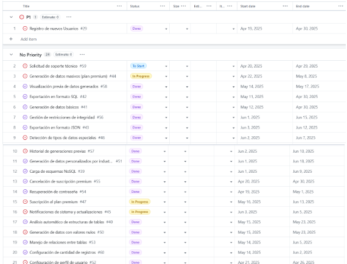

     		  

**UNIVERSIDAD PRIVADA DE TACNA**

**FACULTAD DE INGENIERÍA**

**Escuela Profesional de Ingeniería de Sistemas**

` `**Proyecto “DataFiller”**

Curso: *Pruebas y Calidad de Software*

Docente: *Mag. Patrick Cuadros Quiroga*

Integrantes:

[***SEBASTIAN NICOLAS FUENTES AVALOS](mailto:sf2022073902@virtual.upt.pe)		***(2022073902)***

[***MAYRA FERNANDA CHIRE RAMOS](mailto:mc2021072620@virtual.upt.pe)			***(2021072620)***

[***GABRIELA LUZKALID GUTIERREZ MAMANI](mailto:gg2022074263@virtual.upt.pe) 	***(2022074263)***

**Tacna – Perú**

***2025***

|CONTROL DE VERSIONES||||||
| :-: | :- | :- | :- | :- | :- |
|Versión|Hecha por|Revisada por|Aprobada por|Fecha|Motivo|
|1\.0|MPV|ELV|ARV|10/10/2020|Versión Original|

ÍNDICE GENERAL

[**1. Antecedentes	3**](#_heading=h.9962shri1ylo)

[**2. Planteamiento del Problema	3**](#_heading=h.ebvs8eax4szt)

[a. Problema	3](#_heading=h.va2jmesmmf9)

[b. Justificación	4](#_heading=h.denn7lyknxec)

[c. Alcance	4](#_heading=h.ox5hlzu8chpw)

[**3. Objetivos	5**](#_heading=h.kfyrhwu7zr1w)

[**3.1. Objetivo general	5**](#_heading=h.vzkskpnlxif)

[**3.2. Objetivos Específicos	5**](#_heading=h.5fbfii1oi6v8)

[**4. Marco Teórico	6**](#_heading=h.b1izjeo8lj1b)

[**5. Desarrollo de la Solución	7**](#_heading=h.9z89uzihaero)

[**5.1. Análisis de Factibilidad	7**](#_heading=h.rea1nznto47k)

[**5.1.1. Factibilidad Económica:	7**](#_heading=h.ej8ehklhqn5k)

[**5.1.1.1. Costos Generales	7**](#_heading=h.dygmdjqmd2ov)

[5.1.1.2. Costos operativos durante el desarrollo	7](#_heading=h.z337ya)

[5.1.1.3. Costos del ambiente	8](#_heading=h.3j2qqm3)

[5.1.1.4. Costos de personal	8](#_heading=h.1y810tw)

[5.2. Tecnología de Desarrollo	12](#_heading=h.vguh9b7i1eye)

[5.3. Metodología de implementación (Documento de VISION, SRS, SAD)	13](#_heading=h.6cqmd0t34kux)

[**6. Cronograma	14**](#_heading=h.ngah4sbh6ukr)

[**7. Presupuesto	14**](#_heading=h.v3h5jqxhxwe7)

[**8. Conclusiones	15**](#_heading=h.h5l7on6qydaf)

[**Anexos	16**](#_heading=h.puaejw9xyt9p)

[**Anexo 01 Informe de Factibilidad	16**](#_heading=h.48vxymds932g)

[**Anexo 02   Documento de Visión	16**](#_heading=h.221z5qeepibd)

[**Anexo 03 Documento SRS	16**](#_heading=h.j3nr1pm4s8le)

[**Anexo 04 Documento SAD	16**](#_heading=h.v0jkp0do170x)

[**Anexo 05 Manuales y otros documentos	16**](#_heading=h.lhc1uysgj6ip)

1. # **Antecedentes**		
En el desarrollo de software, la necesidad de realizar pruebas con datos realistas y estructurados es fundamental para garantizar la calidad y fiabilidad del producto final. Sin embargo, la generación de estos datos se ha convertido en un obstáculo frecuente para los equipos de desarrollo y QA. Las soluciones existentes para este problema suelen requerir configuraciones complejas, conocimientos técnicos avanzados o incurren en altos costos de licencia. Esto genera una brecha entre los equipos que cuentan con recursos técnicos y económicos avanzados y aquellos que no.

El proyecto DataFiller surge como una solución accesible, automatizada y eficaz para la generación de datos sintéticos. Inspirado en las necesidades reales de proyectos de software en etapa de desarrollo, busca optimizar tiempo, reducir costos y elevar la calidad de las pruebas sin comprometer la privacidad ni depender de datos reales.
# 							
1. # **Planteamiento del Problema**
# **	
1. ## **Problema**
   Actualmente, la generación de datos de prueba realistas representa un desafío significativo en el desarrollo y aseguramiento de la calidad (QA) del software. Los profesionales de TI dedican un tiempo considerable a la creación manual de estos datos, lo que resulta en procesos lentos, costosos y propensos a errores.

   La falta de datos que reflejen fielmente el entorno de producción impide identificar y corregir errores en etapas tempranas del desarrollo, lo que puede provocar comportamientos impredecibles cuando las aplicaciones entran en producción. Además, la creación manual de datos de prueba limita la capacidad de realizar pruebas exhaustivas con grandes volúmenes de información.

   Por otro lado, el uso de datos reales para pruebas plantea problemas de privacidad y seguridad, especialmente en sectores como salud o finanzas, donde la información es altamente sensible y está sujeta a estrictas regulaciones.

   Las soluciones actuales para la generación de datos de prueba suelen ser complejas, costosas o no ofrecen la flexibilidad necesaria para adaptarse a diferentes tipos de bases de datos y necesidades específicas de cada industria.

1. ## **Justificación**
   La generación de datos de prueba es una tarea crítica pero frecuentemente subestimada en los procesos de desarrollo y aseguramiento de calidad (QA) de software. Los métodos tradicionales, como la creación manual o el uso de datos reales, presentan limitaciones significativas en cuanto a eficiencia, seguridad y escalabilidad. En ese contexto, surge la necesidad de una herramienta que automatice y simplifique este proceso.

   DataFiller responde a esta necesidad al ofrecer una plataforma web accesible que permite generar datos sintéticos realistas, respetando estructuras y relaciones entre tablas, sin comprometer información confidencial ni requerir conocimientos técnicos avanzados. Esto no solo optimiza el tiempo de desarrollo y reduce errores humanos, sino que también mejora la calidad de las pruebas al permitir escenarios más complejos y representativos.

   Además, la implementación de planes diferenciados (gratuito y premium) permite democratizar el acceso a herramientas avanzadas para equipos de desarrollo con recursos limitados, fomentando la equidad tecnológica. La plataforma también se alinea con buenas prácticas de protección de datos y facilita el cumplimiento de normativas de privacidad al eliminar la necesidad de utilizar información real en ambientes de prueba.

1. ## **Alcance**
   El proyecto DataFiller abarca el desarrollo de una plataforma web que permitirá a usuarios generar datos de prueba realistas para bases de datos, con las siguientes funcionalidades e inclusiones:

- Análisis automático de scripts SQL y NoSQL para detectar la estructura de tablas, relaciones y restricciones sin requerir conocimientos técnicos avanzados por parte del usuario.
- Generación de datos sintéticos realistas que respeten las relaciones entre tablas y las restricciones de integridad, con cantidades variables según el plan (10 registros por tabla en plan gratuito, cantidad ampliada en plan premium).
- implementación de un sistema de planes con limitaciones diferenciadas:
  - Plan gratuito: 3 consultas diarias, 10 registros por tabla, formato SQL
  - Plan premium: Consultas ilimitadas, mayor cantidad de registros, todos los formatos, datos personalizados por industria
- Desarrollo de un sistema de autenticación de usuarios y gestión de suscripciones con integración a pasarela de pagos para el plan premium (S/9.99 mensual).
- Interfaz web intuitiva que permita a los usuarios pegar scripts, visualizar resultados y descargar datos generados.
- Sistema de soporte por correo electrónico para todos los usuarios, con atención prioritaria para usuarios premium.
## 		
1. # **Objetivos**		
   1. # **Objetivo general**
      Desarrollar una plataforma web que permita la generación automática de datos de prueba realistas para bases de datos SQL y NoSQL, respetando la estructura de las tablas, sus relaciones y restricciones de integridad.
   1. # **Objetivos Específicos**
- Implementar un sistema de análisis automático de scripts SQL y NoSQL para detectar estructuras de tablas, relaciones y restricciones sin requerir conocimientos técnicos avanzados.
- Desarrollar algoritmos de generación de datos sintéticos realistas que respeten las relaciones entre tablas y restricciones de integridad.
- Crear una interfaz web intuitiva que permita a los usuarios pegar scripts, visualizar resultados y descargar datos generados.
- Implementar un sistema de planes con limitaciones diferenciadas entre usuarios gratuitos y premium.
- Desarrollar un sistema de autenticación de usuarios y gestión de suscripciones con integración a pasarela de pagos.
- Establecer un sistema de soporte por correo electrónico con atención prioritaria para usuarios premium.
# 			
1. # **Marco Teórico**	
- Datos sintéticos

  Son datos generados artificialmente que imitan la estructura, patrones y relaciones de conjuntos de datos reales. Su uso se ha incrementado como una alternativa segura y eficaz para realizar pruebas sin comprometer información sensible.

- Integridad referencial

  Hace referencia a la correcta relación entre registros en tablas relacionales. Al generar datos para pruebas, es fundamental preservar estas relaciones para simular escenarios reales.

- Automatización en pruebas de software

  Se refiere a la utilización de herramientas para realizar pruebas de forma repetitiva y eficiente. La automatización incluye desde la ejecución de pruebas funcionales hasta la preparación de datos y validación de resultados.

- Lenguajes de modelado y documentación (SRS, SAD, Documento de Visión)

  Son estándares utilizados para definir los requisitos del software (SRS), su arquitectura (SAD) y su objetivo global (Visión), permitiendo una mejor planificación, comunicación y control del proyecto.

- DocFX

  Herramienta de generación de documentación automática que convierte archivos Markdown y comentarios en el código fuente en sitios web navegables. Fue clave para la documentación técnica del proyecto DataFiller.

1. # **Desarrollo de la Solución**	
   1. # **Análisis de Factibilidad** 
      1. # **Factibilidad Económica:** 
         1. # **Costos Generales**
            Se presenta a continuación la descripción de los gastos de los **artículos por adquirir**, incluyendo una **computadora**,  junto con sus especificaciones técnicas detalladas y el **costo total** de ambos equipos.
|***Artículo***|***Cantidad***|***Precio Unitario***|***Precio Total***|
| - | - | - | - |
|*Computadora*|*1*|*S/ 1300*|*S/ 1300*|
|*Total costos generales*|*S/ 1300*|||

***Tabla 01**: En Costos Generales se detallan las utilidades con sus cantidades, precios unitarios, obteniendo un total general de S/ 1300.* 

1. ### *Costos operativos durante el desarrollo*
   *Estos son los gastos asociados con la operación del proyecto durante su fase de desarrollo. Incluyen los costos por uso de energía.*

|***Descripción***|***Duración***|***Costo Mensual(PEN)***|***Precio Total***|
| - | - | - | - |
|*Luz*|*1 meses*|*S/ 50*|*S/ 50*|
|*Internet*|` `*meses*|*S/ 40*|*S/ 40*|
|*Total costos operativos*|*S/ 90*|||

*T**abla 02:** En Costos Operativos se listan los costos mensuales de servicios como luz, sumando un total de S/ 90*

1. ### ***Costos del ambiente***

   A continuación, se presenta el desglose de los costos ambientales, que incluyen los gastos asociados al host del servidor y dominio necesarios para mantener el entorno de pruebas y desarrollo durante el periodo planificado.

|***Descripción***|***Costo Mensual(PEN)***|***Precio Total***|
| - | - | - |
|*Host del Servidor* |*S/ 32.5*|*S/ 32.5*|
|
*Dominio*

|*S/ 32.5*|*S/ 32.5*|
|*Total costos ambientales*|*S/ 65*||

***Tabla 03:** En Costos del Ambiente se muestra el costo por internet y host durante tres meses, con un precio mensual y un subtotal de S/ 65.*

1. ### ***Costos de personal***

*Se presenta el desglose de los costos de personal, que corresponden a los sueldos del equipo necesario para el desarrollo y gestión del proyecto, incluyendo desarrolladores, analistas y dirección del proyecto durante el período planificado.*

|*Descripción*|*Cantidad*|*Duración*|*Sueldo*|*Precio Total*|
| - | - | - | - | - |
|*Desarrollador de UI*|*1*|` `*3 meses*|*S/ 850*|*S/ 2550*|
|*Desarrollador*|*1*|*3  meses*|*S/ 850*|*S/ 2550*|
|*Director del proyecto*|*1*|*3 meses*|*S/ 850*|*S/ 2550*|
|*Total costos de personal*|*S/ 7,650*||||

***Tabla 04:** El Costo de Personal muestra los salarios mensuales y totales de tres meses para un Diseñador de UI, un Desarrollador, un Director de Proyecto y un analista de datos, con un costo total combinado de S/ 3600.*

1. **Factibilidad operativa:**

   Se considera viable tras analizar la situación actual, donde se han identificado cuatro áreas principales que requieren mejora: la generación manual de datos de prueba, el cumplimiento de restricciones de integridad, la simulación de datos realistas y la protección de información sensible. Actualmente, los equipos de desarrollo y QA generan estos datos de forma manual, utilizando scripts personalizados o insertando información directamente en las bases de datos de prueba.

   El sistema propuesto transformará estos procesos mediante la implementación de un análisis automático de scripts SQL y NoSQL, reemplazando la interpretación manual actual; el desarrollo de algoritmos de generación de datos que respetan las relaciones entre tablas; la optimización del proceso de creación de datos sintéticos realistas; la integración de una plataforma web para visualización inmediata de resultados; y la creación de un sistema de descarga de datos generados en diferentes formatos.

   Los principales beneficiarios serán los desarrolladores con la reducción del tiempo dedicado a crear datos de prueba, los testers QA con mejor calidad de datos para validaciones, los administradores de bases de datos con datos que respetan la integridad referencial, y los gerentes de proyecto con reducción de costos y tiempos de desarrollo. Se contempla un sistema de soporte y documentación para asegurar la correcta adopción de la plataforma por parte de los usuarios, garantizando así la transformación efectiva de los procesos manuales actuales a una solución tecnológica eficiente.

1. **Factibilidad Social:**

   La implementación del sistema web DataFiller es socialmente beneficiosa, ya que la capacitación permitirá a los desarrolladores y equipos de QA adaptarse rápidamente a una herramienta que automatiza procesos tediosos, mejorando su eficiencia, satisfacción laboral y habilidades técnicas en beneficio de los proyectos de software. Además, hace que la generación de datos de prueba sea más accesible y atractiva para equipos con diferentes niveles de conocimiento técnico, promoviendo mejores prácticas en el desarrollo de software y pruebas.

   Al facilitar el acceso a datos de prueba realistas sin comprometer información sensible, DataFiller contribuye a la protección de la privacidad de los usuarios finales y al cumplimiento de normativas de protección de datos, lo que reduce riesgos legales y éticos relacionados con el manejo de información. Además, la plataforma se convierte en una herramienta educativa que promueve la formación en buenas prácticas de pruebas, creando comunidades de desarrolladores y testers más capacitados.

1. **Factibilidad Legal:**

   La información manejada por la empresa será completamente confidencial. Se aplicará la Ley de Protección de Datos Personales en Perú (Ley N.º 29733), que regula el tratamiento de datos personales, sin importar el soporte en el que sean gestionados. Esta ley garantiza los derechos de las personas sobre sus datos personales y establece las obligaciones para quienes recolectan, almacenan o procesan dicha información.

1. **Factibilidad Ambiental:**

   La implementación del sistema web DataFiller tiene un impacto ambiental reducido, pero se han considerado diversos factores relacionados con la sostenibilidad y los Objetivos de Desarrollo Sostenible (ODS):

- Alineación con ODS 9 (Industria, Innovación e Infraestructura): El proyecto promueve la innovación tecnológica sostenible al optimizar procesos de prueba de software, reduciendo tiempos y recursos necesarios para el desarrollo de aplicaciones.

- Contribución al ODS 12 (Producción y Consumo Responsables): Al facilitar la generación de datos sintéticos, se elimina la necesidad de utilizar datos reales en entornos de prueba, promoviendo un uso más responsable de la información.

- Apoyo al ODS 13 (Acción por el Clima): Mediante la reducción de la huella de carbono asociada al desarrollo de software, contribuyendo a la transición hacia una economía digital más sostenible.

- Digitalización de procesos: El sistema elimina la necesidad de generar datos de prueba manualmente, reduciendo el consumo de energía y recursos asociados a procesos tradicionales más intensivos.

1. ## **Tecnología de Desarrollo**

|***Hardware***||
| - | :- |
|*Servidores*|*1 servidor dedicado con Windows Server (Elastika)*|
|*Estaciones de trabajo*|*3 computadoras para el equipo de desarrollo* |
|*Red y Conectividad*|*Conexión de red LAN y acceso a internet de alta velocidad*|
|***Software***||
|*Sistema Operativo*|*Windows 10 para estaciones de trabajo*|
|*Base de Datos*|*MySQL 8 para gestionar los datos*|
|*Control de Versiones*|*Git (GitHub)*|
|*Navegadores Compatibles*|*Google Chrome, Mozilla Firefox*|
|***Tecnologías de desarrollo***||
|*Lenguaje de Programación*|*PHP versión 8*|
|*Backend*|*Desarrollo utilizando PHP versión 8*|
|*Frontend* |*HTML5, CSS3, JavaScript, Bootstrap*|
|*Plataforma de Desarrollo*|*IDEs como Visual Studio Code* |
##

1. ## **Metodología de implementación (Documento de VISION, SRS, SAD)**
   La metodología de implementación para este proyecto será de tipo predictivo, lo que implica que se seguirá un enfoque secuencial y planificado, con una visión clara de los requisitos y objetivos desde el inicio del proyecto.		
1. # **Cronograma**	

# 							
1. # **Presupuesto**	
   Costos totales del desarrollo del sistema

|*Tipos de costo*|*Subtotal*|
| - | - |
|*Costos Generales*|*S/ 1300*|
|*Costos Operativos*|*S/ 90*|
|*Costos Ambientales*|*S/ 65*|
|*Costos de Personal*|*S/ 7,650*|
|***Total***|***S/ 9,105***|
# 							
1. # **Conclusiones**								
El proyecto DataFiller representa una solución integral y escalable para la generación automatizada de datos de prueba en entornos de desarrollo y pruebas de bases de datos SQL y NoSQL. A lo largo del desarrollo de esta plataforma web, se ha aplicado una arquitectura Modelo-Vista-Controlador (MVC) para garantizar una separación clara de responsabilidades, facilitar el mantenimiento del código y permitir una futura escalabilidad del sistema.

La estructura modular del proyecto, evidenciada en carpetas como controllers, models, y public, ha permitido organizar de forma eficiente la lógica de negocio, las entidades de datos y los recursos del cliente. El uso de bibliotecas externas a través de composer y la integración con FakerPHP para la generación de datos aleatorios personalizados ha sido fundamental para alcanzar la flexibilidad esperada.

Además, se han implementado pruebas unitarias en el directorio tests/Unit, lo cual asegura la estabilidad del núcleo funcional del sistema y refuerza las buenas prácticas de desarrollo orientado a pruebas (TDD). Estas pruebas están diseñadas para garantizar el correcto funcionamiento de los módulos más críticos, apoyándose en herramientas como PHPUnit.

Durante la implementación, se integraron recursos multimedia y archivos generados en carpetas como images/videos, logs, y resultados\_BORRABLE, los cuales demuestran la interacción activa del usuario con la plataforma y el resultado tangible del procesamiento de datos.

Asimismo, el despliegue en la nube mediante Azure App Service y la organización del repositorio en GitHub favorecen una integración continua y control de versiones eficiente, alineado con metodologías DevOps.

En resumen, DataFiller no solo cumple con su objetivo principal de ofrecer datos realistas para pruebas, sino que también sienta las bases para convertirse en una herramienta robusta y extensible en el ecosistema de desarrollo ágil. Su estructura organizada, el uso de herramientas modernas y la clara orientación a la calidad del software lo posicionan como una solución tecnológica sólida y de gran utilidad para desarrolladores y testers.										
# **Anexos**										
# **Anexo 01 Informe de Factibilidad**
\- URL: <https://datafiller3.sytes.net/docs/informes/fd01-informe-factibilidad.html> 

\- Proceso completo de automatización DocFX
# **Anexo 02   Documento de Visión**
\- URL: [https://datafiller3.sytes.net/docs/informes/fd01-informe-vision.html](https://datafiller3.sytes.net/docs/informes/fd01-informe-factibilidad.html) 

\- Proceso completo de automatización DocFX
# **Anexo 03 Documento SRS**
\- URL: [https://datafiller3.sytes.net/docs/informes/fd01-informe-srs.html](https://datafiller3.sytes.net/docs/informes/fd01-informe-factibilidad.html) 

\- Proceso completo de automatización DocFX
# **Anexo 04 Documento SAD**
\- URL: [https://datafiller3.sytes.net/docs/informes/fd01-informe-sad.html](https://datafiller3.sytes.net/docs/informes/fd01-informe-factibilidad.html) 

\- Proceso completo de automatización DocFX
# **Anexo 05 Manuales y otros documentos**
**Anexo 05.1 Manual de Usuario (generado con DocFX)**

\- URL:

<https://datafiller2-b2cbeph0h3a3hfgy.eastus-01.azurewebsites.net/docs/manual/user-manual.html> 

\- Basado en trazas de sistema y videos de pruebas

**Anexo 05.2 Documentación Técnica del Sistema**

\- URL:

<https://datafiller2-b2cbeph0h3a3hfgy.eastus-01.azurewebsites.net/docs/manual/technical.html> 

\- Generada automáticamente con DocFX

**Anexo 05.3 Informe de Documentación Final**

\- URL:

<https://datafiller2-b2cbeph0h3a3hfgy.eastus-01.azurewebsites.net/docs/manual/fd05-informe.html> 

\- Proceso completo de automatización DocFX

**Anexo 05.4 Trazas de Pruebas de Interfaz**

\- Logs de actividades de usuario

\- Videos de pruebas funcionales

\- Capturas de pantalla de procesos

**Anexo 05.5 Configuración y Workflows**

\- Archivo docfx.json de configuración

\- GitHub Actions workflows

\- Proceso de deploy automático

